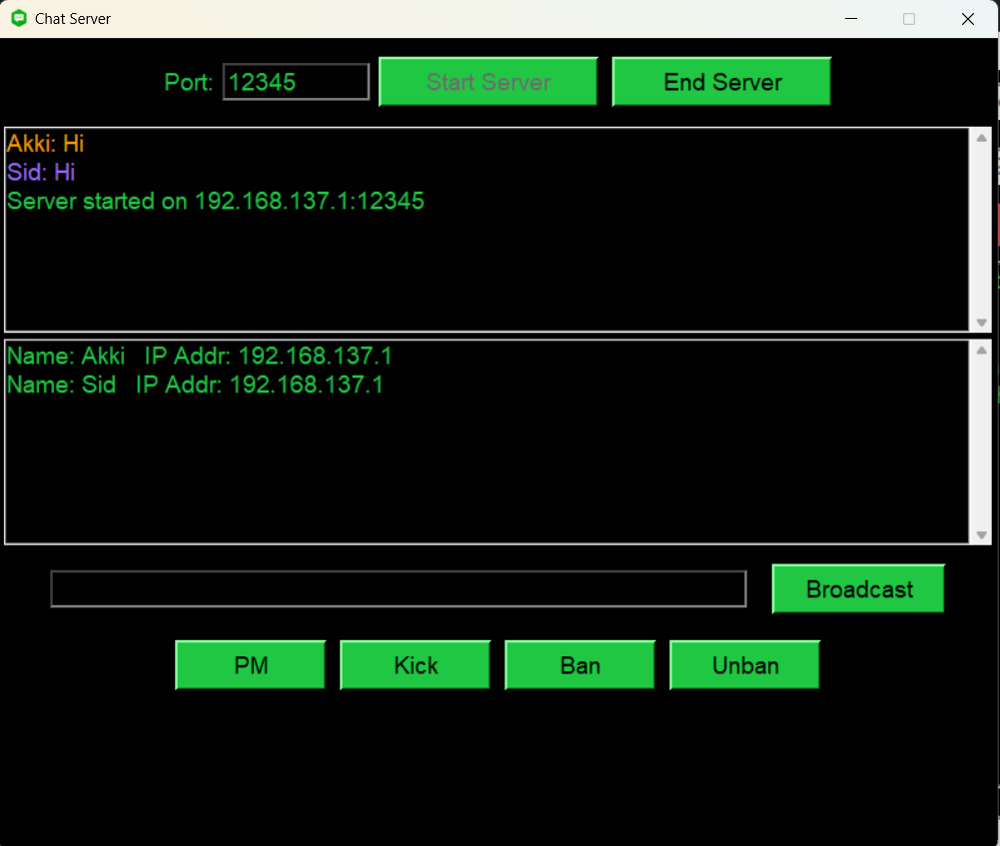
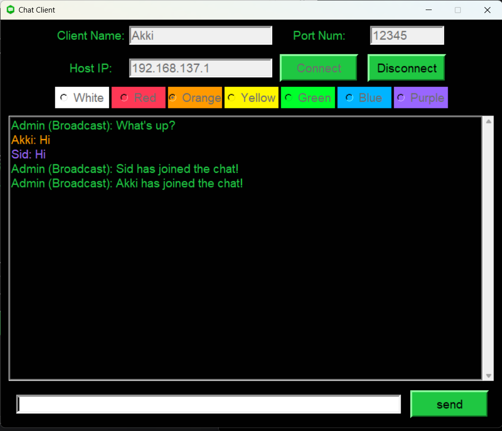
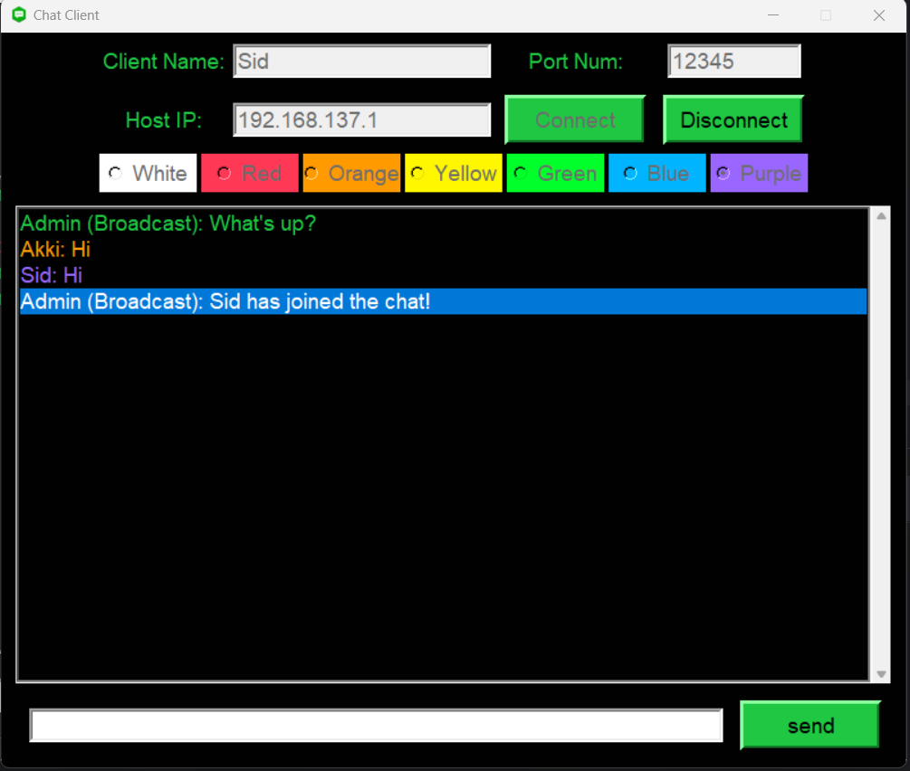

# ChatRoom application

## Description

ChatRoom is a Python-based application that enables the creation of a multi-user chat room with a graphical user interface (GUI). It consists of two main components: a server-side application for administration and a client-side application for users to join and participate in the chat.

### Server-Side ChatRoom (Admin)

The server-side component is responsible for managing the chat room. It provides an interface for server administrators to oversee client connections, send messages, and maintain order within the chat. The server allows for:

- Starting and stopping the chat server.
- Accepting incoming client connections.
- Managing connected clients, including kicking and banning.
- Broadcasting messages to all clients.
- Sending private messages to specific clients.

### Client-Side ChatRoom

The client-side component is designed for end-users to connect to the chat server, send and receive messages, and customize their display name and text color. Key features include:

- Connecting to a server using a username, server IP address, and port.
- Choosing a text color for chat messages.
- Real-time sending and receiving of chat messages.
- Disconnecting from the server when done.

## Use Cases

- **Online Chat Rooms**: ChatRoom can be used to create online chat rooms for communities, support groups, or social gatherings. Users can join, chat, and share information.

- **Team Communication**: In a professional setting, ChatRoom can facilitate team communication, allowing team members to collaborate, discuss projects, and share updates.

- **Customer Support**: Businesses can implement ChatRoom for customer support, enabling customers to connect with support agents for assistance.

- **Private Messaging**: Users can have private conversations by selecting specific recipients and sending private messages.

## Prerequisites

To run ChatRoom, you need to have Python installed on your system. The server and client components use the tkinter library for GUI development.

## Getting Started

1. Clone this repository to your local machine or download the source code.

2. Open a terminal or command prompt.

3. Navigate to the directory where the source code is located.

4. Run the server-side application by executing the following command:

python ```python server.py```

5. Run the client-side application by executing the following command:

python ```python client.py```


6. Follow the prompts in the GUI windows for both server and client applications.

## Screenshots







## License

This project is licensed under the [MIT License](LICENSE).

## Acknowledgments

ChatRoom is built using Python and the tkinter library for GUI development. It provides a versatile platform for online communication and collaboration.

Feel free to customize and modify the application to suit your specific needs. If you have questions or need assistance, please don't hesitate to reach out at sawanpatel2508@gmail.com.
